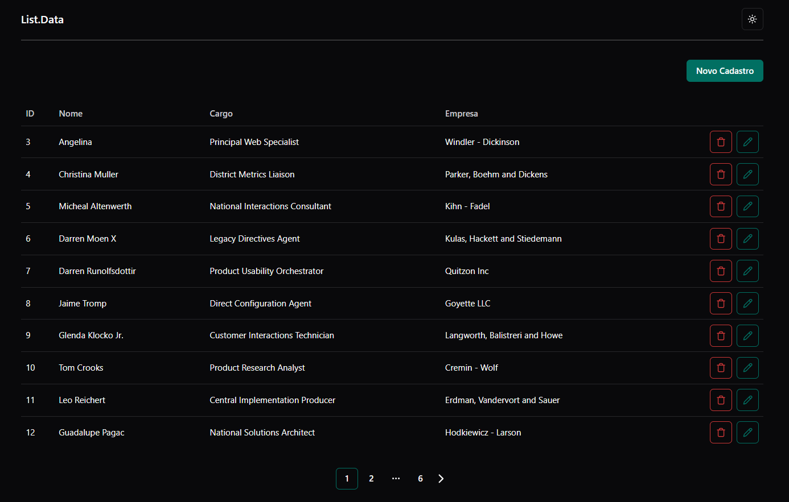

<h1 align="center"> List.Data </h1>

<p align="center">
    Teste Técnico Front-End
<br/>
</p>

<p align="center">
  <a href="#-tecnologias">Tecnologias</a>&nbsp;&nbsp;&nbsp;|&nbsp;&nbsp;&nbsp;
  <a href="#-projeto">Projeto</a>&nbsp;&nbsp;&nbsp;|&nbsp;&nbsp;&nbsp;
  <a href="#-layout">Layout</a>&nbsp;&nbsp;&nbsp;
</p>
<br>

<p align="center">
  
</p>

## 🚀 Tecnologias

Esse projeto foi desenvolvido com as seguintes tecnologias:

- Next.js
- Typescript
- Tailwind
- Shadcn
- React Hook Form

## 💻 Projeto

List.Data é uma aplicação web que exibe uma lista de usuários, permitindo adicionar, editar e excluir registros de forma fácil e organizada. Os dados são carregados de uma API e apresentados de maneira clara, com paginação para facilitar a navegação.

A interface é moderna e responsiva, garantindo uma boa experiência tanto no desktop quanto no celular. Além disso, há um formulário validado para cadastro e edição de usuários, além de um modal de confirmação para exclusões.

O List.Data foi desenvolvido para ser intuitivo e eficiente, tornando a gestão de usuários mais simples e acessível.

## 🔖 Layout

Você pode visualizar o layout do projeto através [DESSE LINK](https://www.figma.com/design/kKPDADBlNAuNA4Jb6kuy6B/List.Data?node-id=0-1&t=vj7iHEyRXblANSQc-1).

## ↔️ Fluxo

1. Início (Home):

- Exibe uma lista de usuários com paginação.
- Permite acessar a página de criação para adicionar novos usuários.
- Disponibiliza opções para editar ou excluir usuários da lista.
- Inclui uma modal de confimação de exclusão ao clicar no botão de exclusão.

2. Criação (New):

- Apresenta um formulário para cadastrar um novo usuário.
- Valida os campos obrigatórios antes de permitir o envio.
- Permite descartar/limpar os dados preenchidos no formulário.

3. Edição (Edit):

- Exibe os detalhes de um usuário já cadastrado.
- Permite modificar as informações e salvar as alterações.
- Possibilita retornar à página inicial caso não deseje realizar a edição.

## 🏗️ Decisões Arquiteturais

O List.Data foi desenvolvido com foco em simplicidade, escalabilidade e boas práticas de organização de código. Abaixo estão algumas das principais decisões arquiteturais tomadas:

- Next.js 14 com Server Components: Optei por usar Next.js com os recursos do Server Components, o que proporciona uma melhor performance ao carregar os dados da API diretamente no servidor, reduzindo a carga no cliente.

- TypeScript: A escolha do TypeScript garante maior segurança de tipo e facilita o desenvolvimento, evitando erros comuns no código.

- Organização por Pastas Funcionais: A estrutura de pastas foi pensada para ser clara e escalável, separando ações (como interações com a API), hooks personalizados, componentes reutilizáveis e páginas específicas de criação e edição de usuários.

- React Hook Form: Utilizei o React Hook Form para gerenciar os formulários de criação e edição de usuários. Ele simplifica o gerenciamento de estados e validações, proporcionando uma melhor experiência de desenvolvimento.

- Tailwind CSS: A escolha do Tailwind CSS visa facilitar a criação de layouts responsivos e de fácil manutenção, mantendo o código limpo e otimizado.

- Design System: Seguindo um design system básico, consegui garantir uma interface consistente, reutilizando componentes como botões, inputs e tabelas de forma modular e reutilizável.

## 📂 Estrutura

```bash
src/
src/
├── actions         # Funções responsáveis por interagir com a API
├── app             # Páginas e configurações das telas
│   ├── new         # Tela de cadastro de usuário
│   └── edit        # Tela de edição de usuário
├── components      # Componentes reutilizáveis ou específicos do projeto
├── hooks           # Hooks personalizados para encapsular lógica reutilizável
├── lib             # Configurações de bibliotecas vinculadas ao projeto
├── provider        # Providers de bibliotecas e contextos utilizados
├── types           # Tipagens dos dados utilizados no projeto
```

## 📌 Instruções

```bash
# Clonar o repositório
git clone https://github.com/mylenavitoriano/FrontendTest.git

# Entrar no diretório
cd frontend-test

# Baixar as dependências (npm || yarn)
npm install
yarn

# Executar a aplicação (npm || yarn)
npm run dev
yarn dev
```
